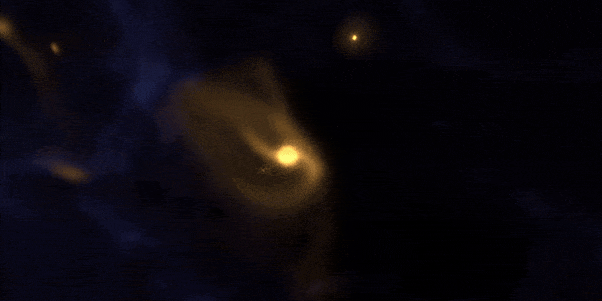

# shr3yas-k

I’m really interested in scientific computing, especially simulations in astrophysics and quantum systems.  
I enjoy exploring computational models, algorithms, and projects that combine code with science.

  

*Credit: [Simulation of colliding galaxies by NASA's JWST](https://svs.gsfc.nasa.gov/10661/)*
